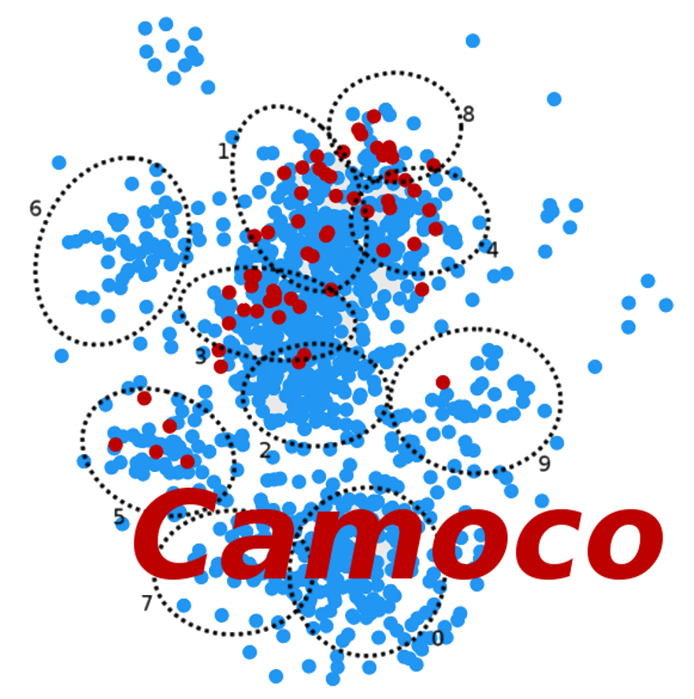

.. Camoco documentation master file, created by
   sphinx-quickstart on Tue Dec 20 15:10:35 2016.
   You can adapt this file completely to your liking, but it should at least
   contain the root `toctree` directive.

.. _overview:
.. currentmodule:: camoco

Introduction
############

**Camoco** is a python library for building and analyzing gene co-expression
networks.  Networks are built from tables of gene expression data typically derived 
from RNA-seq or micro-array experiments. Once networks are built, there are several 
tools available to validate or check the *health* of the co-expression network using 
annotated ontologies such as the `Gene Ontology <http://www.geneontology.org/>`__.
Co-expression can then be calculated among sets of genes using several different
metrics.

In addition to building and validating co-expression networks, Camoco can also
be used to directly integrate data from `Genome-Wide Association Studies
(GWAS) <https://en.wikipedia.org/wiki/Genome-wide_association_study>`__. Using a
window based method, markers (SNPs) from GWAS are mapped to candidate genes and
then analyzed for strong co-expression. Camoco identifies high priority overlap
(i.e. between GWAS data and network data) by identifying genes near GWAS SNPs
that have strong co-expression to genes near other GWAS SNPs. Results are
compared to randomized networks to assign p-values to candidate genes. This
approach is explained in detail in the publication cited below.

Camoco comes with a command line interface (CLI) for standardized analyses, 
but was also designed in a way where it can be extensively customized and 
modified within python scripts.

Camoco offers several key features for network analysis:

* **Quality control** of gene expression data before network generation
* Datasets are built once and stored in **internal databases** for repeated use
* Network **clusters** are automatically `calculated <https://micans.org/mcl/>`__
* Customizable **network plotting** methods
* On the fly GWAS **SNP-to-gene mapping**

Citation
========
Camoco and its applications have been published in The Plant Cell. If you make
use of Camoco in your work, please cite the following:

  Robert Schaefer, Jean-Michel Michno, Joseph Jeffers, Owen A Hoekenga, Brian P
  Dilkes, Ivan R. Baxter, Chad Myers. **Integrating networks and GWAS in maize.**
  The Plant Cell Nov 2018, tpc.00299.2018; `DOI: 10.1105/tpc.18.00299
  <https://doi.org/10.1105/tpc.18.00299>`__

Table Of Contents
=================

.. toctree::
    :caption: Table of Contents
    :maxdepth: 1
  
    Introduction <index> 
    Overview <overview>
    Installation <installation>
    Tutorial: Pt I: CLI <tutorial>
    Strengths and Limitations <limitations>

Indices and tables
==================

* :ref:`genindex`
* :ref:`search`

